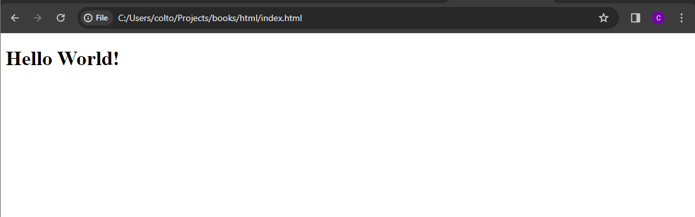

# Chapter 1: Core Concepts & Terminology

Welcome to the first step of your web development journey! This chapter is all about laying a solid foundation. We'll demystify the jargon and introduce the essential concepts of HTML and web development. Whether you're an absolute beginner or brushing up on basics, this chapter will align our understanding and prepare you for the exciting journey ahead.

If you come across a word that you don't recognize or understand, please check the **[Dictionary](./dictionary.md)** for help.

## What is Web Development?

Web development is the art and science of building websites and web applications. It encompasses everything from creating simple static web pages to complex, interactive web applications. There are three main layers to web development:

- **Frontend (Client-Side):** This is what you see and interact with on a website. It's all about the user experience, involving HTML for structure, CSS for styling, and JavaScript for functionality.
- **Backend (Server-Side):** This involves the server, database, and applications that work behind the scenes. It's where the data processing happens, and it supports the frontend.
- **Full Stack:** A combination of both frontend and backend development. Full-stack developers can handle all aspects of web development.

In this book, we will only be discussing HTML, which perhaps to your surprise, can fall into the category of Full Stack. But, for the purpose of the book, we will mainly focus on HTML on the client only.

For the time being let's just focus on this one concept. **HTML is used by the Web Browser**.

### Now, what exactly does that mean?

To put it simply, you will write HTML "code" as text, aka, not binary or some weird format, just think of it as plain text, that follows specific grammar and rules.

Once you have written your HTML code, you can save it to a file using a special extension `.html`. This tell the web browser that the text is HTML based and it will begin "parsing" (aka reading) the text and do it's magic.

Now, to fully demonstrate this in a simplistic way, we will do an exercise.

### Exercise

Create a new file, with the `.html` extension (ie: `my-page.html`) and open it in a text editor, such as **Notepad**, or whatever you use to right plain text. The editor should **not** write text in a rich format, like **Word**.

Now, let's copy/paste this HTML into the new file.

```html
<!DOCTYPE html>
<html>
  <body>
    <h1>Hello World!</h1>
  </body>
</html>
```

Now, save the file and copy the file location of the newly saved `.html` file. If you are on a Windows computer, it may look something like this `file:///C:/Users/bob/Desktop/my-page.html`.

Now, here is where the **magic** happens. Open up a Web Browser, such as **Google Chrome**, **Firefox**, or **Safari**, and paste the full file location into your URL bar at the top.

If done correctly, you will see something like this.



Notice how the only thing you see is the text **Hello World!** and none of the other code was shown to you. This is how HTML works, the browser took your code and created representation of it for you to view.

Now, you may be asking, what everything means or does inside the code we just wrote. We will get into that in the upcoming chapters, for now, let's celebrate our 1st step into the magical journey of the web.

#### Exercise Problems?

If you experience any issues with the exercise, please ensure the following conditions are met:

1. You copy/pasted the correct code into the file.
1. You saved the file with the correct extension `.html`.
   - Make sure the file was not saved with any hidden extensions added to it.
1. You copied the correct _full_ location of the file.

Another issue that _may_ come up is your browser or computer are not correctly determining the file is on your computer and instead trying to browser the internet or search on a search engine for that file. If that is the case, your setup may have some issues. You can attempt to google solutions, or just continue following along for now.

## Understanding HTML

At its core, HTML is the language that web browsers understand to display web pages. Here's how it works:

- **Tags and Elements:** HTML uses tags to markup text, images, and other content to display it on the web page. For example, `<p>` is a tag for paragraph text.
- **Attributes:** Tags can have attributes that provide additional information about an element, such as ``, where src and alt are attributes of the img tag.
- **Structure:** An HTML document has a defined structure, including a doctype declaration, and `<html>`, `<head>`, and `<body>` sections.

In our previous [exercise](#exercise) we created a simple html structure using a **doctype declaration**, the `<html>` tag, the `<body>` tag, and finally the `<h1>` tag.

### Doctype Declaration

Looks like this: `<!DOCTYPE html>`

This is always the first line of the code and is special as it includes an exclamation `!` and no self-closing symbol or closing tag. _We will learn what self-closing & closing tags are in the upcoming content._

You can safely assume every single HTML file you write will include this in it.

_I am not going to go too much into this tag and why/what it means, but feel free to research more on it._

### `<html>`

Every HTML page will include 1 of these tags, the `<html>` will be the **root** tag _(root meaning the top-level or outer most)_ and wrap around both the `<head>` and `<body>` tags.
_We did not use a `<head>` tag in our exercise._

Notice how we **close** this tag at the end by adding what is called a **closing tag** `</html>`.

When working with HTML, there is a hierarchy order & structure that you must follow. This is part of the _grammar_ of the language.

The base layout of HTML will always follow this structure. _Excluding the Doctype Declaration_

```html
<html>
  <head></head>
  <body></body>
</html>
```

Creating a hierarchy structure like so:

```
├─ html
  ├─ head
  │─ body
```

### `<head>`

Every HTML page can include 1 of these tags, the `<head>` will be the first child tag _(nested 1 level below)_ of the `<html>` tag.

This tag is special and will indicate "hints" & **meta** data/information to the browser that are related to the HTML page.

### `<body>`

Every HTML page can include 1 of these tags, the `<body>` will be the second child tag _(nested 1 level below)_ which follows the `<head>` tag, of the `<html>` tag.

This tag is where all of your web page content will live. And is where we put the `<h1>` tag in our exercise, which displayed the text **Hello World!**.

## HTML Tags

Refers to a type of HTML code and is surrounded with angle brackets (ex: `<` `html` `>`).

_Almost_ all tags have a start and end (aka closing) associated with them to indicate where the tag starts and ends to the Web Browser (ie: HTML parser).

Common tags are `<html>`, `<head>`, `<body>`, and `<h1>`.

### Closing Tag

Refers to a the end of a tag and is always written with a slash `/`, like this `</html>`.

A tag that has a closing tag with it will typically have child tags or content nested inside, like so.

```html
<html>
    <body>
        <h1>Hello World!</h1>
    </head>
</html>
```

Every start tag wraps another tag and each tag has an associated closing tag to denote the end of that tag and it's contents.

#### Caution:

Make sure that all closing tags are in order of when they are opened. In other words, you would not close a tag that has child tags inside it that are not closed yet.

For example, this is incorrect:

```html
<h1><b>Hello!</h1> World</b>
```

Notice how the `<h1>` tag was closed BEFORE the `<b>` tag, which is a child of the `<h1>` tag. This is incorrect order of tags and incorrect HTML.

The `/` must come BEFORE the name of the tag and NOT after. _This is an incorrect closing tag `<html/>`_

### Self-Closing Tags

Refers to a tag that is self-closing, and does not have a start & end tag, but instead is a standalone tag that starts and ends in one reference.

A self-closing tag will have the `/` at the end of it before the `>`, like this `<link />`.

A self-closing tag is used to easily start & end a tag that has no content inside and does not have any child tags nested in it.

Common self closing tags are `<link />`.

#### Caution:

Not all tags can be self-closing and will result in issues with your HTML code.

For example, you cannot self-close `<html>`, `<head>`, `<body>`, `<h1>`, and many others.
