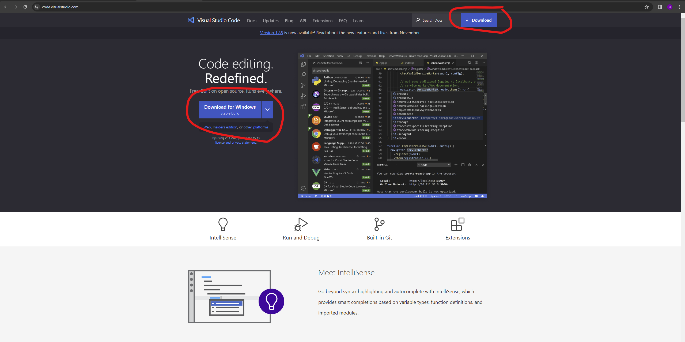
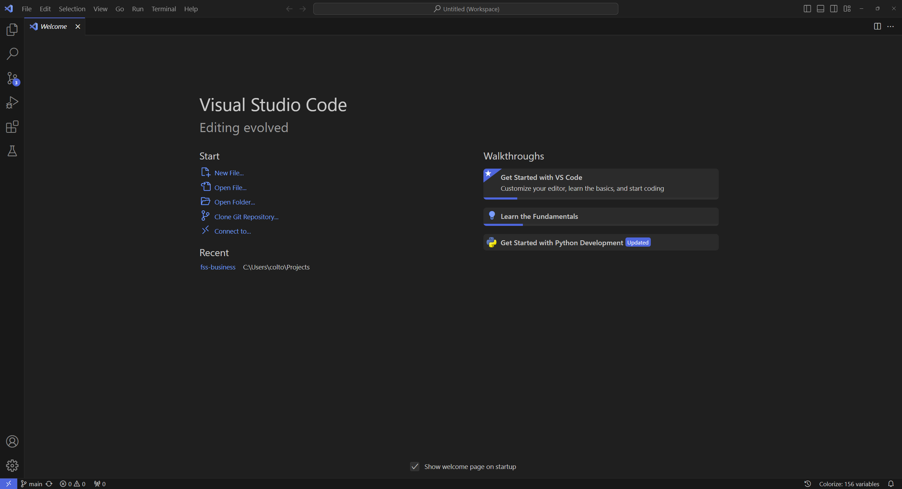
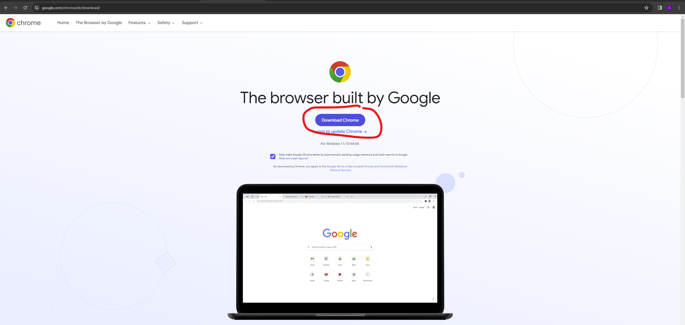

# Chapter 2: Setting Up Your Environment

In this chapter, we'll prepare your workstation for HTML development. Setting up a proper environment is crucial for efficient coding and testing. Don't worry; it's simpler than it sounds and doesn't require any advanced technical skills.

## Tools You'll Need

To write HTML, you only need two tools: a text editor and a web browser. Let's explore the options and get you set up.

### Text Editor

A text editor is where you'll write your code. While you can use any basic editor like Notepad (Windows) or TextEdit (Mac), specialized code editors offer features like syntax highlighting and auto-completion that make coding easier and more enjoyable.

#### Visual Studio Code (VS Code)

A free, open-source editor with robust HTML, CSS, and JavaScript support. It's popular for its extensions and community support.

Go [here](https://code.visualstudio.com/) to download the software, and then follow the installation steps by clicking & opening the downloaded file.

Once downloaded and installed, open VS Code.

### Web Browser

A web browser is where you'll view your HTML files to see how they look and behave in a real web environment. Any modern browser will do, but it's good to have a few options to see how your pages look across different browsers.

#### Google Chrome

Offers extensive developer tools, making it a favorite among web developers.

Go [here](https://www.google.com/chrome/dr/download/) to download the software, and then follow the installation steps by clicking & opening the downloaded file.

Once downloaded and installed, open Chrome.

