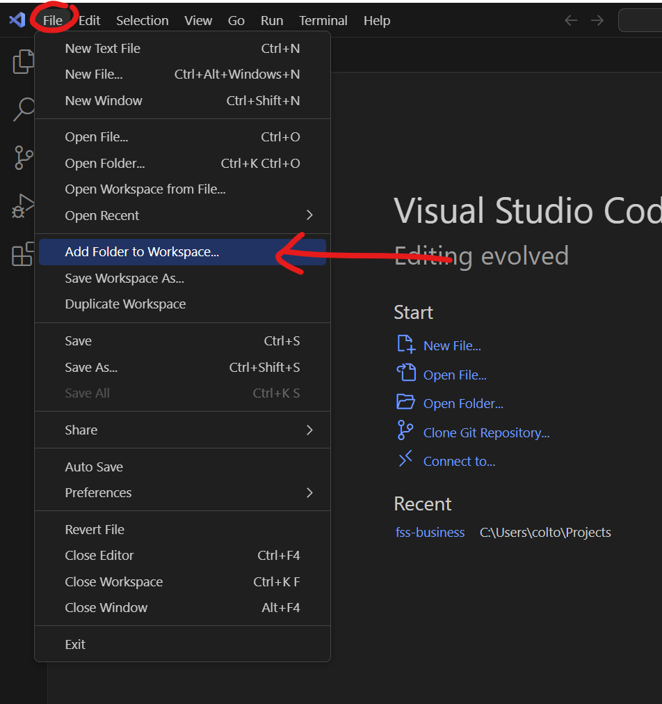

# Chapter 2: Setting Up Your Environment

In this chapter, we'll prepare your workstation for HTML development. Setting up a proper environment is crucial for efficient coding and testing. Don't worry; it's simpler than it sounds and doesn't require any advanced technical skills.

## Tools You'll Need

To write HTML, you only need two tools: a text editor and a web browser. Let's explore the options and get you set up.

### Text Editor

A text editor is where you'll write your code. While you can use any basic editor like Notepad (Windows) or TextEdit (Mac), specialized code editors offer features like syntax highlighting and auto-completion that make coding easier and more enjoyable.

#### Visual Studio Code (VS Code)

A free, open-source editor with robust HTML, CSS, and JavaScript support. It's popular for its extensions and community support.

Go [here](https://code.visualstudio.com/) to download the software, and then follow the installation steps by clicking & opening the downloaded file.

Once downloaded and installed, open VS Code.

### Web Browser

A web browser is where you'll view your HTML files to see how they look and behave in a real web environment. Any modern browser will do, but it's good to have a few options to see how your pages look across different browsers.

#### Google Chrome

Offers extensive developer tools, making it a favorite among web developers.

Go [here](https://www.google.com/chrome/dr/download/) to download the software, and then follow the installation steps by clicking & opening the downloaded file.

Once downloaded and installed, open Chrome.

## Getting Started

Now that we have our tools installed, let's start by setting up our very first "official" HTML project that we will be using throughout the course.

### Setting up new Project in VS Code

Open up **VS Code** to follow along.

#### Step 1: Add Folder to Workspace

Click **File** -> **Add Folder to Workspace**.

#### Step 2: Right-Click and create new Folder

A folder window will pop-up, and ask you to select a new Folder to add to VS Code.

Let's navigate to **Desktop**, then **Right-Click** inside the window pane where the red text is, which will pop-up another new window.

In the new window, hover over **New**, then click The **Folder** option.

#### Step 3: Newly created Folder

Once you selected **Folder**, a new Folder will appear with the highlighted text **New folder**.

#### Step 4: Rename the new Folder

Let's rename the folder something else, like **HTML-Project**.

#### Step 5: Select/Highlight the new Folder that was created

Once you have your new folder with the name you want, you can select the folder _(it will show a grey highlight when selected)_ and then click the **Add** button on the bottom right.

#### Step 6: Add the new Folder to VS Code view

After adding the Folder, the pop-up window will disappear and you should see the newly added folder show up inside **VS Code Explorer view**. If you do not see this view, make sure to open the **VS Code Explorer view** by clicking on the top-left icon circled in the image.

#### Step 7: Add a new File to the Folder from VS Code

Right click on **HTML-Project** to show a pop-up menu, then click **New File...**

#### Step 8: Rename the new File in VS Code

An empty file will show up with a prompt to text/input the name of the new file. Let's name it **my-first-html-page.html** and click **Enter** to save the name.

#### Step 9: Display the new File in VS Code

You should now see the new file inside your new project and VS Code will also have the file open to edit which is in the main pane on the right of the folder & file view.

### Showing your HTML file in the Browser

Open up **VS Code** and **Chrome** to follow along.

#### Step 1: Right-click and Copy Path

Right-click on the file you want to view in the browser, and then click **Copy Path**. _This will copy the file path location on your machine, and will be used to tell the browser where your HTML file is._

The copied path will look something like this if you are on Windows. `C:\Users\colto\OneDrive\Desktop\HTML-Project\my-first-html-page.html`

##### Caution

Do **not** select **Copy Relative Path**, this is not the _full_ path and may result in issues when loading the HTML on your browser.

#### Step 2: Paste the copied path into Chrome URL bar

Go to **Chrome** and paste the copied file path into Chrome's URL bar on the top.

#### Step 3: Click Enter

Click Enter to load the HTML file into Chrome.

You should see a blank white screen showing, and Chrome may also display the **File** icon to the right of the URL bar, indicated it is displaying from a file instead of from the internet. _This is how you develop with HTML locally without having to go through the internet._

#### Step 4: Re-loading Chrome when the file changes

You can click the **Reload** icon to the right of the URL bar anytime the you edit and save the file to display the latest changes.

