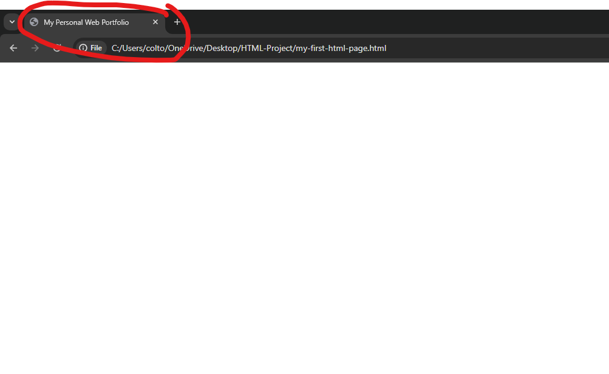
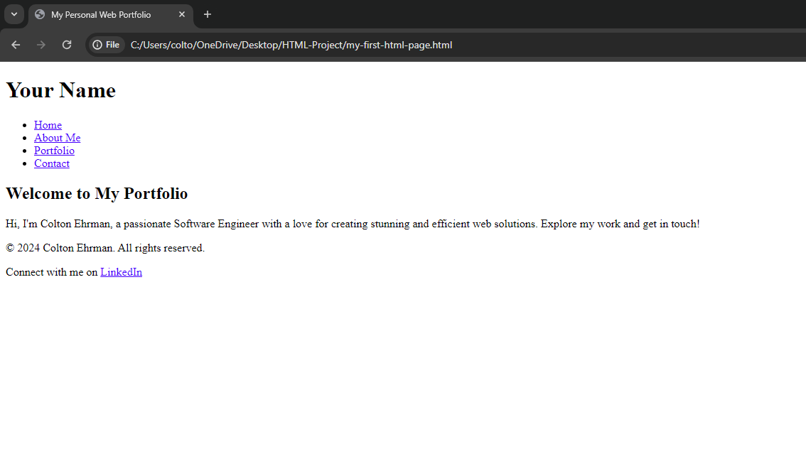

# Chapter 3: Introducing our Personal Portfolio Project

Welcome to Chapter 3, a pivotal moment in your journey to becoming a proficient web developer. As we delve into this chapter, we stand at the threshold of turning our vision into reality—starting with the foundation of your very own Personal Portfolio Website. This project isn't just about learning HTML; it's about creating a platform where you can showcase your skills, projects, and the journey you're embarking on as you progress through this book.

## Table of Contents

- [The Project at a Glance](#the-project-at-a-glance)
- [Starting with the Basics](#starting-with-the-basics)
  - [`<title>`](#title)
- [Building the Foundation](#building-the-foundation)
  - [Creating the Header & Navigation](#creating-the-header--navigation)
    - [`<header>`](#header)
    - [`<nav>`](#nav)
    - [`<a>`](#a)
    - [`<ul>`](#ul)
    - [`<li>`](#li)
  - [Adding a Hero Section](#adding-a-hero-section)
    - [`<section>`](#section)
    - [`<h1>`](#h1)
    - [`<p>`](#p)
  - [Creating the Footer](#creating-the-footer)
    - [`<footer>`](#footer)
    - [`&copy;`](#copy)

## The Project at a Glance

Our project, the Personal Portfolio Website, will serve as a dynamic canvas for your growing web development skills. It's designed to be a practical, hands-on experience that not only teaches you the ins and outs of HTML and later CSS and JavaScript but also gives you a tangible asset that you can use in your professional life. Think of it as your digital calling card, a place where your work, skills, and passion for development come together to tell a compelling story about who you are as a developer.

## Starting with the Basics

With clarity on purpose, audience, content, and organization, you're ready to start coding. Begin with the basic structure:

```html
<!DOCTYPE html>
<html>
  <head>
    <title>My Personal Web Portfolio</title>
  </head>

  <body>
    <!-- Your content goes here -->
  </body>
</html>
```

This template is your starting point, a container waiting to be filled with your creative and structured content based on the earlier reflections.

### `<title>`

The new `<title>` tag was introduced and is a special child of the `<head>` tag, which allows you to give your Website a title that is shown on your Browser's tab.



## Building the Foundation

The `<header>` & `<nav>` for your site's name and navigation. A compelling `<section>` for your hero area to introduce yourself. Then the `<footer>`, grounding your site with necessary information and links.

_All the content we add will be nested inside the `<body>` tag._



### Creating the Header & Navigation

Our header is the top of the Web page and typically includes some site navigation elements in it to easily guide the viewer.

```html
<header>
  <h1>Colton Ehrman</h1>
  <nav>
    <ul>
      <li><a>Home</a></li>
      <li><a>About Me</a></li>
      <li><a>Portfolio</a></li>
      <li><a>Contact</a></li>
    </ul>
  </nav>
</header>
```

#### `<header>`

The `<header>` tag can be used to indicate a Websites header information to the viewer. This should **not** be confused with the `<head>` tag, which is intended for the Browser, not the viewer.

Inside the `<header>` we can provide a site navigation with the `<nav>` tag to guide the viewer around our website via `<a>` tag links.

On every HTML page, there should only ever be 1 unique `<header>` tag used, similar to the `<footer>`.

#### `<nav>`

The `<nav>` tag can be used to indicate a Websites navigation links via `<a>` tags. The `<nav>` tag can typically be found inside a `<header>`, as traditionally the top part (aka `header`) of a Website would usually showcase navigation links to the viewer to click around the Website.

Inside the `<nav>` we can provide clickable links with the `<a>` tag that will navigate the viewer to a different part or section of the Website.

#### `<a>`

The `<a>` tag is called the **anchor** tag is and is meant to _link_ to another web page, or section of a web page. It can be used an configured a couple different ways, and typically has an **href** attribute added to it. _We have not talked attributes yet, but will soon._

#### `<ul>`

The `<ul>` tag is called an **un-ordered list** tag is and is used when creating a bullet-list of items, sort of like a todo list. There is another type of list tag `<ol>` (aka **ordered list**) which is used when the list is ordered with something like numbers (ie: 1, 2, 3...).

When using either `<ul>` or `<ol>` tags, you will pair them with child elements of `<li>` for this individual items inside the list.

#### `<li>`

The `<li>` tag is called a **list item** and is nested inside a `<ul>` or `<ol>` for individual list items. Each `<li>` would wrap the content of the item that you want inside the list.

### Adding a Hero Section

Your first question may be, what is a "Hero" section? **Hero** is a common term used in Web design for the initial section that shows up when first viewing a Web page. The hero is what stands out and is the most prominent section of the whole page.

```html
<section>
  <h2>Welcome to My Portfolio</h2>
  <p>Hi, I'm Colton Ehrman, a passionate Software Engineer with a love for creating stunning and efficient web solutions. Explore my work and get in touch!</p>
</section>
```

#### `<section>`

The `<section>` tag is meant to wrap a particular section of a Web page and used to sort of group things together. _When it comes to styling, sections are useful to add specific styles to each section, or create common styling across all sections._

A good way to think about HTML is grouping things into boxes/sections and creating a hierarchical structure of parent->child elements for each area of the Web page.

The `<header>` and `<footer>` tags are specific "sections" of a Web page, where-as the `<section>` is more of a generic section and sandwiched in-between the `<header>` and `<footer>` elements.

Another generic tag for grouping things is the `<div>` tag, but this tag has no "semantic" value to it and is not preferred to use, and instead should work with semantic tags such as `<header>`, `<footer>`, and `<section>`.

#### `<h1>`

The `<h1>` tag is called **Heading One** and can be thought of as the biggest piece of text on the Web page.

There are other headings as well, `<h2>`, `<h3>`, and so on all the way to `<h6>`, which is the "smallest" heading tag.

Think of a heading as like a "headline" of a news article or blog.

You can have a single heading (like `<h1>`) as a title, and other headings throughout the page to indicate a new section of text.

#### `<p>`

The `<p>` tag is a **Paragraph** of text. I think the purpose of this is pretty self-explanatory. Defer to the article metaphor used with the **Heading** tags.

### Creating the Footer

Our footer is typically found at the very bottom of the Web page and can be used for a navigation, copyright statement, and social links.

```html
<footer>
  <p>&copy; 2024 Colton Ehrman. All rights reserved.</p>
  <p>Connect with me on <a>LinkedIn</a></p>
</footer>
```

#### `<footer>`

The `<footer>` tag is a semantic tag for wrapping the footing of a Web page.

#### `&copy;`

This is **not** a tag, but instead called an HTML symbol. Which are special "codes" that can be used to add something that is not a normal character such as `a` through `z`.

Symbols have different codes for different reasons, but when adding a symbol to an HTML page, you want to use the **HTML code** or **HTML entity**, which is prefixed with the `&` sign *(and the `#` sign if using an entity)* and suffixed with the `;` sign.

_The **code** for the same copyright symbol is `&#169;`. Which can be used interchangeably with `&copy;`. Just a matter of preference, but I prefer the **entity**._

_Go [here](https://www.toptal.com/designers/htmlarrows/symbols/) to find more symbols that you can use in HTML._

### Putting it all Together

Now, let's put everything together into a single HTML code for the page.

```html
<!DOCTYPE html>
<html>
  <head>
    <title>My Personal Web Portfolio</title>
  </head>

  <body>
    <header>
      <h1>Colton Ehrman</h1>
      <nav>
        <ul>
          <li><a>Home</a></li>
          <li><a>About Me</a></li>
          <li><a>Portfolio</a></li>
          <li><a>Contact</a></li>
        </ul>
      </nav>
    </header>

    <section>
      <h2>Welcome to My Portfolio</h2>
      <p>Hi, I'm Colton Ehrman, a passionate Software Engineer with a love for creating stunning and efficient web solutions. Explore my work and get in touch!</p>
    </section>

    <footer>
      <p>&copy; 2024 Colton Ehrman. All rights reserved.</p>
      <p>Connect with me on <a>LinkedIn</a></p>
    </footer>
  </body>
</html>
```

## [Back to Chapter 2](/html/chapters/2/README.md)

## [Chapter 4](/html/chapters/4/README.md)
