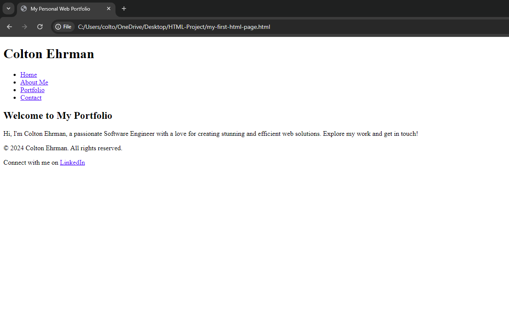

# Chapter 3: Introducing our Personal Portfolio Project

Welcome to Chapter 3, a pivotal moment in your journey to becoming a proficient web developer. As we delve into this chapter, we stand at the threshold of turning our vision into reality—starting with the foundation of your very own Personal Portfolio Website. This project isn't just about learning HTML; it's about creating a platform where you can showcase your skills, projects, and the journey you're embarking on as you progress through this book.

## Table of Contents

- [The Project at a Glance](#the-project-at-a-glance)
- [Starting with the Basics](#starting-with-the-basics)
  - [`<title>`](#title)
- [Building the Foundation](#building-the-foundation)
  - [Creating the Header & Navigation](#creating-the-header--navigation)
    - [`<header>`](#header)
    - [`<nav>`](#nav)
    - [`<a>`](#creating-the-header--navigation)
    - [`<h1>`](#creating-the-header--navigation)
    - [`<ul>`](#creating-the-header--navigation)
    - [`<li>`](#creating-the-header--navigation)
  - [Adding a Hero Section](#adding-a-hero-section)
  - [Creating the Footer](#creating-the-footer)

## The Project at a Glance

Our project, the Personal Portfolio Website, will serve as a dynamic canvas for your growing web development skills. It's designed to be a practical, hands-on experience that not only teaches you the ins and outs of HTML and later CSS and JavaScript but also gives you a tangible asset that you can use in your professional life. Think of it as your digital calling card, a place where your work, skills, and passion for development come together to tell a compelling story about who you are as a developer.

## Starting with the Basics

With clarity on purpose, audience, content, and organization, you're ready to start coding. Begin with the basic structure:

```html
<!DOCTYPE html>
<html>
  <head>
    <title>My Personal Web Portfolio</title>
  </head>

  <body>
    <!-- Your content goes here -->
  </body>
</html>
```

This template is your starting point, a container waiting to be filled with your creative and structured content based on the earlier reflections.

### `<title>`

The new `<title>` tag was introduced and is a special child of the `<head>` tag, which allows you to give your Website a title that is shown on your Browser's tab.


## Building the Foundation

The `<header>` & `<nav>` for your site's name and navigation. A compelling `<section>` for your hero area to introduce yourself. Then the `<footer>`, grounding your site with necessary information and links.



### Creating the Header & Navigation

```html
<header>
  <h1>Your Name</h1>
  <nav>
    <ul>
      <li><a>Home</a></li>
      <li><a>About Me</a></li>
      <li><a>Portfolio</a></li>
      <li><a>Contact</a></li>
    </ul>
  </nav>
</header>
```

#### `<header>`

The `<header>` tag can be used to indicate a Websites header information to the viewer. This should **not** be confused with the `<head>` tag, which is intended for the Browser, not the viewer.

Inside the `<header>` we can provide a site navigation with the `<nav>` tag to guide the viewer around our website via `<a>` tag links.

On every HTML page, there should only ever be 1 unique `<header>` tag used, similar to the `<footer>`.

#### `<nav>`

The `<nav>` tag can be used to indicate a Websites navigation links via `<a>` tags. The `<nav>` tag can typically be found inside a `<header>`, as traditionally the top part (aka `header`) of a Website would usually showcase navigation links to the viewer to click around the Website.

Inside the `<nav>` we can provide clickable links with the `<a>` tag that will navigate the viewer to a different part or section of the Website.

### Adding a Hero Section

```html
<section>
  <h2>Welcome to My Portfolio</h2>
  <p>
    Hi, I'm Colton Ehrman, a passionate Software Engineer with a love for
    creating stunning and efficient web solutions. Explore my work and get in
    touch!
  </p>
</section>
```

### Creating the Footer

```html
<footer>
  <p>&copy; 2024 Colton Ehrman. All rights reserved.</p>
  <p>
    Connect with me on
    <a>LinkedIn</a>
  </p>
</footer>
```

## [Back to Chapter 2](/html/chapters/2/README.md)

<!-- ## [Chapter 3](/html/chapters/3/README.md) -->
